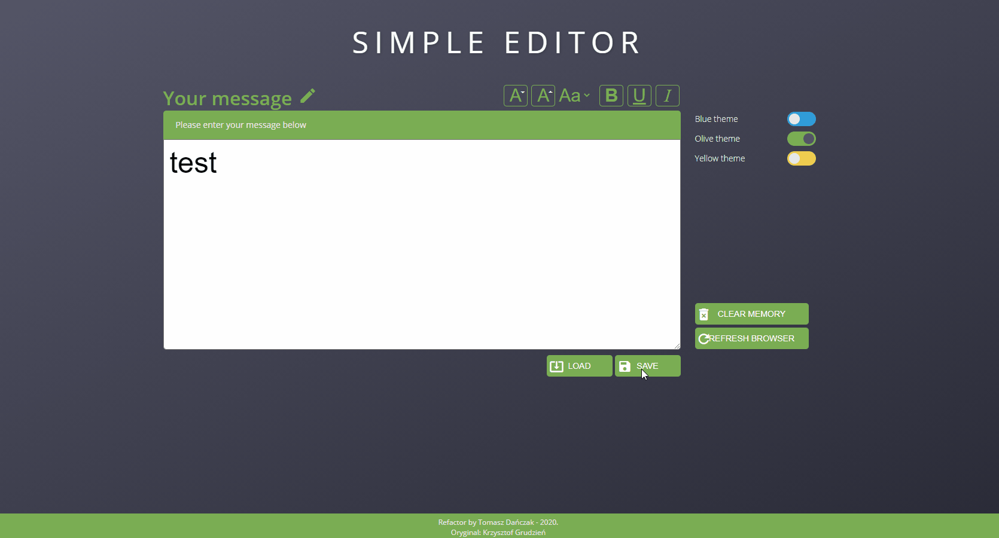
# WTF - The Simple Editor 
It is my refactoring of an interesting project built by [Krzysztof Grudzień ](https://github.com/KrzysztofGrudzien)
## 🚀 Things I made myself
### 👉 I built a minimalistic Webpack configuration
(only the necessary configurations to run the project)  
  
  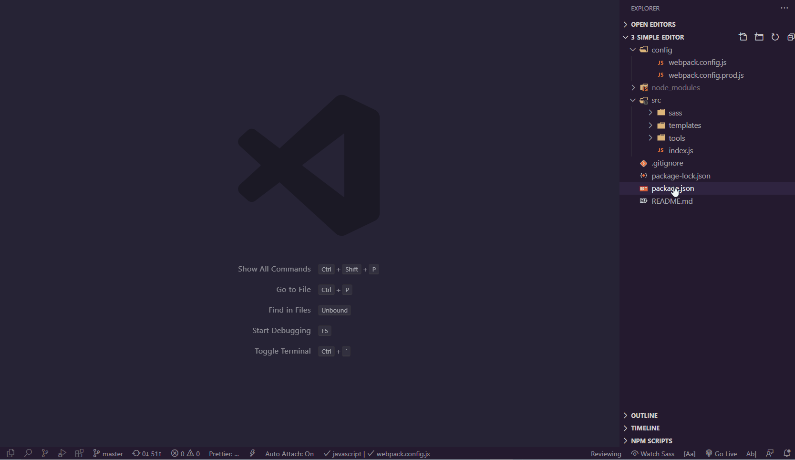
### 👉 I built the Git history 
  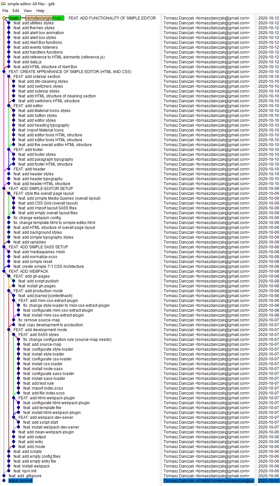
### 👉 I used JS modules 
  
  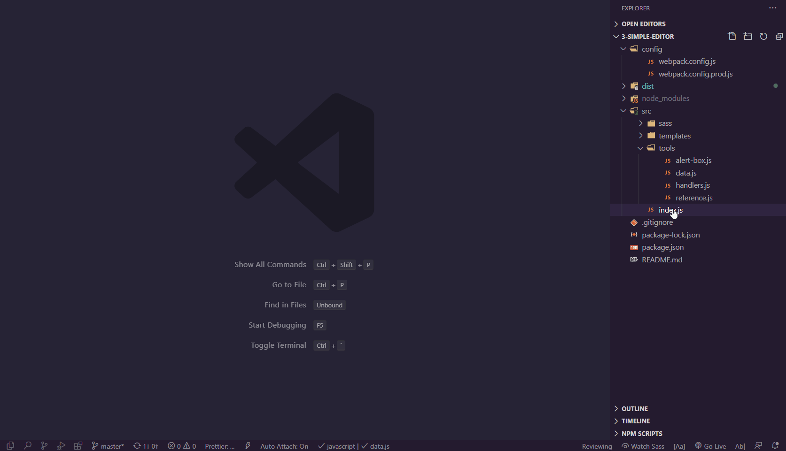
### 👉 I rebuilt Media Queries and used other Mixin  
  
  
  
### 👉 I changed 7-1 CSS Architecture
### 👉 I changed BEM
## 🚀 Things I learned from Krzysztof
### 👉 **How to create notification bar**  
  
  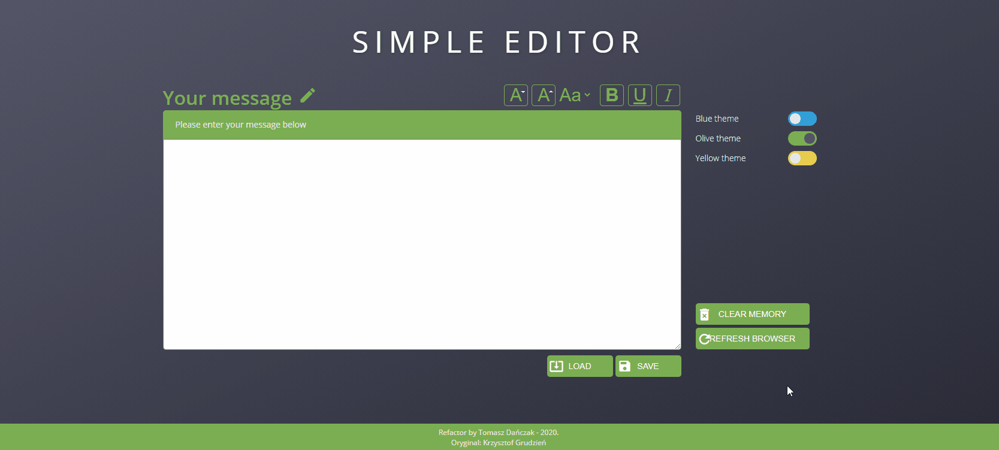  
    
  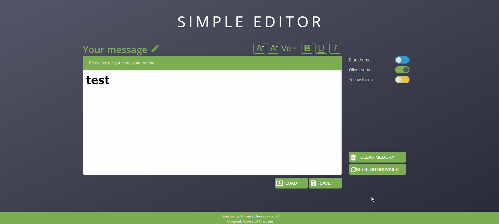
### 👉 **How to create a toogle switch**  
  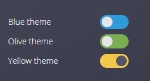
### 👉 **How to create multiple themes**  
  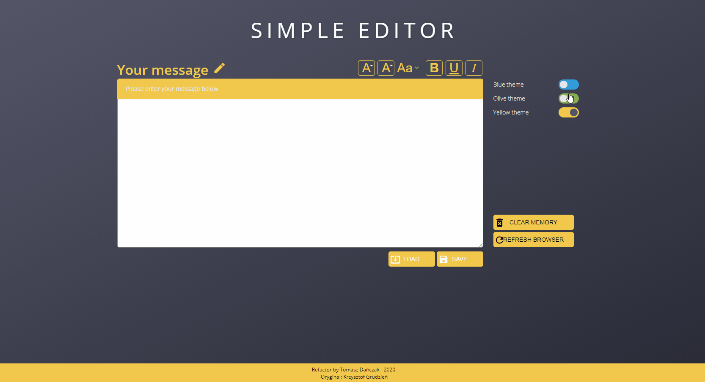

## 🚀 Tech stack
👉 Webpack  
👉 Git  
👉 Visual Studio Code  
👉 CSS (Grid, Flexbox, Animations)  
👉 Media Queries  
👉 SASS  
👉 7-1 CSS Architecture  
👉 BEM  
👉 Emmet  
👉 Auto Hotkey  
👉 Bash  
👉 VIM  

## 🚀 Webpack configuration which I created includes
👉 SASS file support  
👉 SourceMap support  
👉 gh-pages  
👉 clean-webpack-plugin  
👉 html-webpack-plugin  
👉 mini-css-extract-plugin    
👉 clean-webpack-plugin

### webpack.config.js
```javascript
const path = require("path");
const { CleanWebpackPlugin } = require("clean-webpack-plugin");
const HtmlWebpackPlugin = require("html-webpack-plugin");

module.exports = {
  devtool: "source-map",
  mode: "development",
  entry: {
    main: "./src/index.js",
  },
  output: {
    filename: "js/[name].js",
    path: path.resolve(__dirname, "../", "dist"),
  },
  module: {
    rules: [
      {
        test: /\.(sass|scss)$/,
        use: [
          "style-loader",
          {
            loader: "css-loader",
            options: {
              sourceMap: true,
            },
          },
          {
            loader: "sass-loader",
            options: {
              sourceMap: true,
            },
          },
        ],
      },
    ],
  },
  plugins: [
    new CleanWebpackPlugin(),
    new HtmlWebpackPlugin({
      title: "Simple Editor",
      template: "src/templates/simple-editor.html",
    }),
  ],
};
```
### webpack.config.prod.js
```javascript
const path = require("path");
const { CleanWebpackPlugin } = require("clean-webpack-plugin");
const HtmlWebpackPlugin = require("html-webpack-plugin");
const MiniCssExtractPlugin = require("mini-css-extract-plugin");

module.exports = {
  mode: "development",
  entry: {
    main: "./src/index.js",
  },
  output: {
    filename: "js/[name]-[contenthash].js",
    path: path.resolve(__dirname, "../", "dist"),
  },
  module: {
    rules: [
      {
        test: /\.(sass|scss)$/,
        use: [MiniCssExtractPlugin.loader, "css-loader", "sass-loader"],
      },
    ],
  },
  plugins: [
    new CleanWebpackPlugin(),
    new HtmlWebpackPlugin({
      title: "Simple Editor",
      template: "src/templates/simple-editor.html",
    }),
    new MiniCssExtractPlugin({
      filename: "css/[name]-[contenthash].css",
    }),
  ],
};

```

### Commands?
- `npm start` - to start development mode
- `npm run prod` - to start production mode
- `npm run publish` - to publish on Github

## 🚀 Some VSC, Text Expander shortcuts I used  
👉 `Ctrl + Shift + K` - Delete line    
  
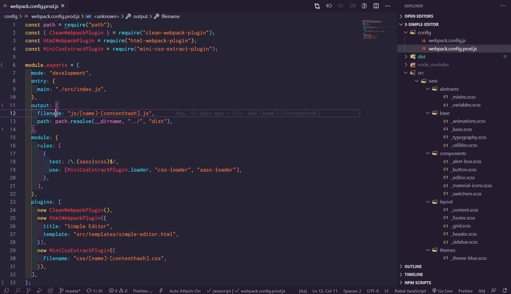
  
👉 `Ctrl + Enter` - Insert line below   
  
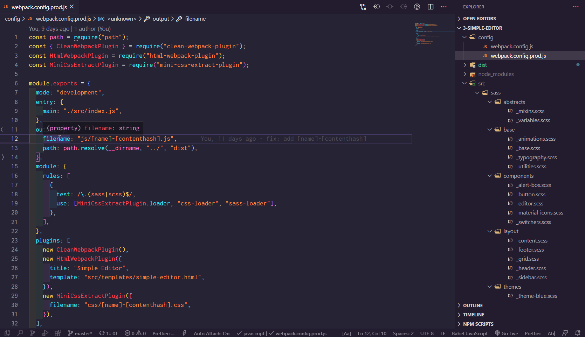  
  
👉 `Alt+ ↑ / ↓` - Move line up/down  
  
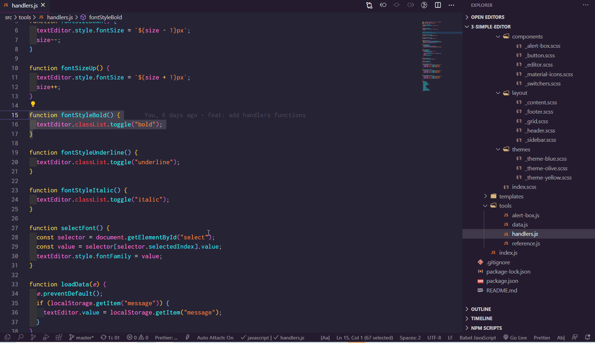  
  
👉 `Shift+Alt + ↓ / ↑` - Copy line up/down   
  
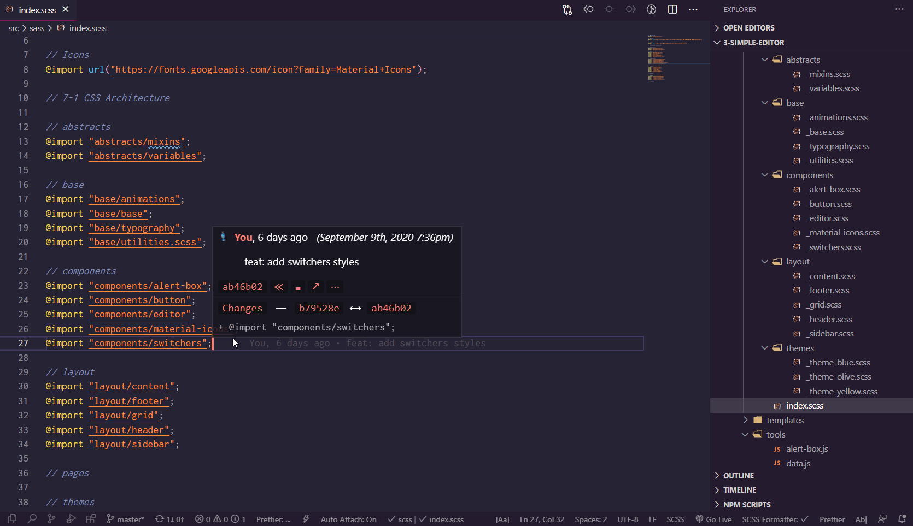  
  
👉 `Ctrl + R` - Open Recent  
  
  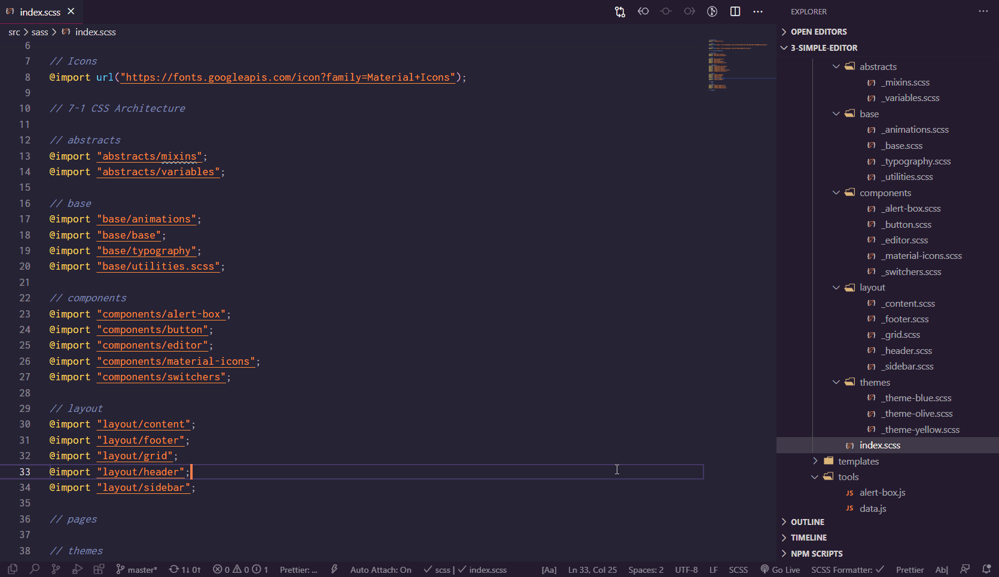  
    
👉 `Alt + click` - Go to function definition  
   
  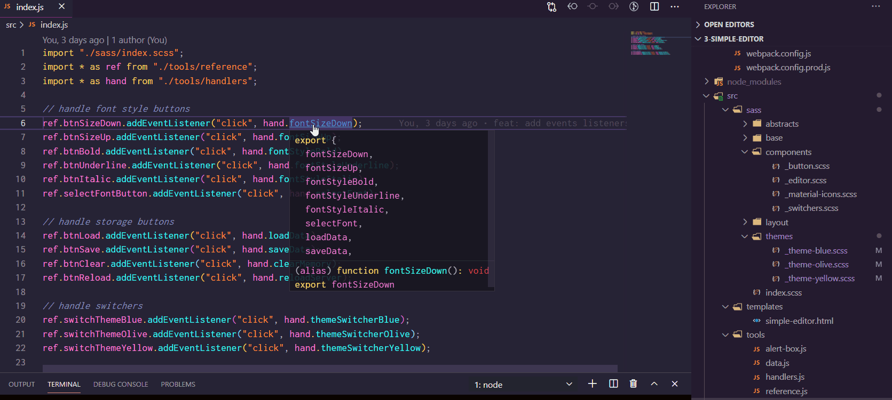
   
👉 `Ctrl + D` - Add selection to next find match  
  
  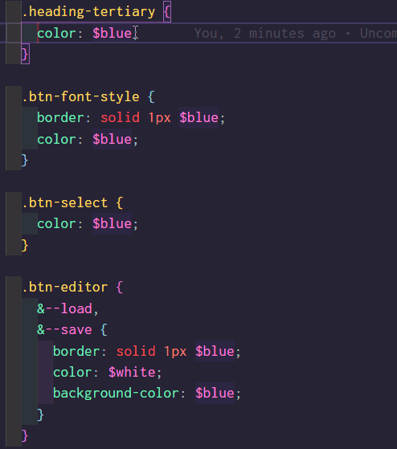  
    
👉 Auto Hotkey  
  
  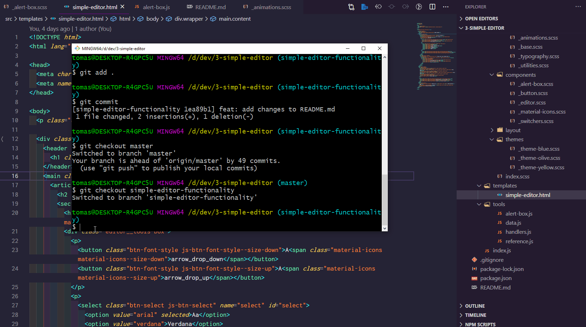


